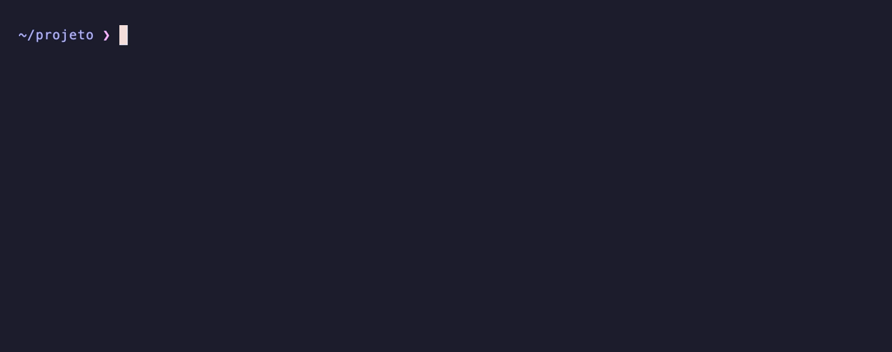

# 🧯 translate

> **Aquele erro em inglês no terminal? Joga no `translate` e leia em português.**
> Tradutor de linha de comando **offline** que traduz **erros de terminal, stack traces e código** — além de texto normal — entre **português**, **inglês** e **espanhol**. Roda 100% local com o modelo [`aya-expanse`](https://ollama.com/library/aya-expanse) no [Ollama](https://ollama.com). Sem internet, sem API paga, sem custo.


<p align="center">
  
</p>

O caso de uso principal: **encanar a saída de erro de qualquer comando** pro `translate` e ler em português, com a mensagem traduzida mas o código, os caminhos e os identificadores preservados.

```bash
$ python3 app.py 2>&1 | translate
Traceback (mais recente chamado por último):
  Arquivo "app.py", linha 12, em <módulo>
    print(1 + [])
          ~~^~~~
Erro: tipos de operandos não suportados para '+': 'int' e 'list'

$ git push 2>&1 | translate
erro: não foi possível ler o repositório remoto. Verifique se você tem as
permissões corretas e se o repositório existe.
```

E claro, também traduz texto do dia a dia:

```bash
$ translate "how are you doing today?"
Como você está hoje?

$ translate -t es "estou viajando pro Chile amanhã"
Voy a viajar a Chile mañana.
```

---

## ✨ Recursos

- **Feito pra erros** — traduz mensagens de erro, stack traces e logs preservando código, caminhos de arquivo, comandos, URLs e identificadores; traduz só a prosa legível.
- **100% offline** — roda no seu Mac via Ollama, nada sai da máquina.
- **Detecção automática de direção** — EN/ES entram → saem em PT-BR; PT entra → sai no idioma-destino (padrão EN).
- **Várias formas de entrada** — argumento, pipe/stdin, arquivo, clipboard ou modo interativo.
- **Saída limpa** — só a tradução no `stdout`, sem quebras artificiais nem lixo de terminal, ideal pra encadear com outros comandos; opção de copiar pro clipboard.
- **Ajuda colorida** — `translate -h` com um menu bonito (e limpo quando redirecionado).

## 📋 Pré-requisitos

- **macOS** (usa `pbpaste`/`pbcopy`) com **zsh** ou **bash**.
- **[Homebrew](https://brew.sh)** — usado pelo instalador pra instalar o Ollama, caso ele ainda não exista.
- **`python3`** — usado pra conversar com a API local do Ollama (só a biblioteca padrão). Já vem com as ferramentas de linha de comando do Xcode ou com o Homebrew.

O **Ollama** e o modelo **`aya-expanse`** *não* precisam estar instalados de antemão: o `install.sh` cuida disso pra você (veja abaixo).

## 🚀 Instalação

```bash
git clone https://github.com/berodcdev/translate-cli.git
cd translate-cli
./install.sh          # interativo: pergunta antes de instalar cada coisa
# ./install.sh -y     # assume "sim" em tudo (não interativo)
```

O `install.sh` deixa tudo pronto de ponta a ponta, **pedindo confirmação** antes de instalar cada peça:

1. **Ollama** — se não existir, instala via `brew install ollama`.
2. **Servidor** — sobe o Ollama caso não esteja respondendo.
3. **Modelo** — baixa o `aya-expanse` com `ollama pull` se faltar *(atenção: ~5 GB)*.
4. **Comando global** — cria um **symlink** em `~/bin/translate` (edições futuras no projeto valem na hora) e dá `chmod +x`.
5. **PATH** — avisa, com a linha exata pro `~/.zshrc`, se `~/bin` não estiver no `PATH`.

> Se o instalador disser que `~/bin` não está no `PATH`, adicione ao seu `~/.zshrc` e recarregue:
> ```bash
> echo 'export PATH="$HOME/bin:$PATH"' >> ~/.zshrc && source ~/.zshrc
> ```

## 🎯 Uso

```
translate [opções] ["texto" | arquivo]
translate [opções] < arquivo
comando | translate [opções]
```

### Formas de entrada

| Modo         | Exemplo                                      |
| ------------ | -------------------------------------------- |
| Argumento    | `translate "how are you"`                    |
| Pipe / stdin | `cat texto.txt \| translate`                 |
| Arquivo      | `translate documento.md`                     |
| Clipboard    | `translate -c`                               |
| Interativo   | `translate` *(sem argumentos; sai com Ctrl-D ou `sair`)* |

### Opções

| Flag         | Descrição                                                     |
| ------------ | ------------------------------------------------------------- |
| `-t <lang>`  | Força o idioma-destino: `en`, `es` ou `pt`                    |
| `-c`         | Lê o texto de entrada do clipboard (`pbpaste`)                |
| `-o`         | Copia a tradução pro clipboard (`pbcopy`), além de imprimir   |
| `-h`, `--help` | Mostra a ajuda e sai                                        |

### Exemplos

```bash
npm run build 2>&1 | translate    # traduz o erro do comando pro PT-BR
python3 app.py 2>&1 | translate   # traduz o traceback inteiro
translate erro.log                # traduz um log salvo em arquivo
translate "how are you"           # EN → PT-BR (detecção automática)
translate -t es "bom dia"         # PT → ES (destino forçado)
translate -c                      # traduz o que está no clipboard
translate -o "copie isso"         # traduz e já copia o resultado
translate                         # modo interativo
```

> 💡 Use `2>&1` pra mandar também o **stderr** (onde os erros aparecem) pro `translate`.

## ⚙️ Configuração

No topo do script `translate`, duas variáveis bem visíveis:

```bash
MODELO="aya-expanse"          # troque aqui pra testar outro modelo do Ollama
DESTINO_PADRAO_PT="en"        # destino quando a entrada estiver em português
```

## 🧠 Como funciona

- Fala com a **API HTTP local** do Ollama (`POST /api/generate` em `localhost:11434`, com `stream:false`). O `python3` (só a stdlib) monta o JSON e lê a resposta — assim a saída vem **limpa**, sem as quebras de linha e escapes ANSI que o `ollama run` injeta ao formatar pro terminal (o que atrapalharia justamente a tradução de erros longos).
- O texto vai entre marcadores (`<<<INICIO>>>`/`<<<FIM>>>`) num prompt firme, pra o modelo tratar o conteúdo como algo a **traduzir** (nunca uma pergunta/ordem pra responder) e preservar código, caminhos e identificadores.
- A **direção** é resolvida por uma chamada curta de detecção de idioma (`pt`/`en`/`es`) seguida da regra: EN/ES → PT-BR, PT → `DESTINO_PADRAO_PT`. A flag `-t` força o destino e pula a detecção.

## 📁 Estrutura

```
translate-cli/
├── translate        # script principal (bash)
├── install.sh       # instalador (Ollama + modelo + symlink em ~/bin)
├── assets/
│   ├── demo.gif     # GIF de demonstração
│   └── demo.tape    # roteiro do GIF (vhs)
├── README.md
└── LICENSE
```

## 📝 Licença

MIT

---

Desenvolvido por **[dev@bernardorodc.com](mailto:dev@bernardorodc.com)**
